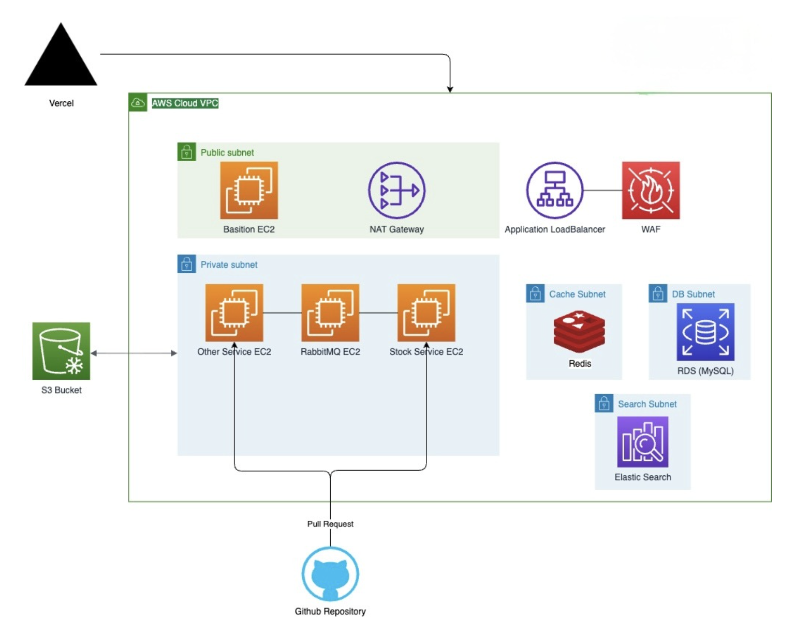

SanSam은 DAU 10만 명 규모의 커머스 서비스를 가정하고 고부하 환경에서도 안정적인 주문 생성, 재고 차감, 결제 처리를 목표로 설계한 이커머스 백엔드 서버입니다.

## 프로젝트 개요

- 프로젝트명: SanSam
- 개발 기간: 2025.07 ~ 2025.12
- 개발 인원: BE (4), FE (1)
- 담당 역할: 팀장, 주문/결제/재고/상태 도메인 설계 및 구현
- 프로젝트 목적: 무신사 주문 결제 팀 시스템의 DAU 30만 명, 분당 최대 1.5만 건 주문 처리 사례를 참고해 DAU 10만 명 규모의 커머스 서비스를 가정했습니다. 피크 시간대 주문, 결제 요청을 발생시키는 사용자를 기준으로 Peak VUser 1,000명을 산정하고, 이를 기반으로 고부하 환경에서도 안정적인 주문 생성, 재고 차감, 결제 처리가 가능한 서버를 설계 및 개발했습니다.

## 기술 스택

| 구분 | 기술 |
|---|---|
| Language | Java 21 |
| Framework | Spring Boot 3.5.4, Spring MVC, Spring Data JPA, Spring Batch, Spring Scheduler |
| Database | MySQL, H2(Test) |
| Cache / Lock | Redis, Redis Lua Script, Caffeine Cache |
| Search | Elasticsearch |
| Message / Realtime | WebSocket, SSE, Spring Event, Outbox Worker |
| External API | Toss Payments, AWS S3, AWS SES |
| ORM / Query | JPA, QueryDSL, MapStruct |
| Test | JUnit5, Mockito, AssertJ, Spring Batch Test, JaCoCo |
| Infra | Docker, AWS VPC, EC2, ALB, WAF, RDS(MySQL), Redis, S3, GitHub |
| Monitoring | Spring Actuator, Micrometer Prometheus |

- `Redis Lua Script`: 주문 시 재고 선점 수량을 Redis에서 원자적으로 증가시키고, 총 재고를 초과하면 즉시 실패시키기 위해 사용했습니다.
- `Caffeine Cache`: 자주 조회되지만 변경 빈도가 낮은 주문/결제/상품 상태값을 캐싱해 상태 조회 부하를 줄였습니다.
- `Outbox Worker`: 결제 승인 이후 DB 처리 실패, 주문 만료 후 재고 복구처럼 외부 API와 DB 트랜잭션 경계가 다른 작업을 재시도 가능한 구조로 분리했습니다.
- `Spring Scheduler`: 주문 만료 처리, 결제 취소 보상, 재고 일일 동기화, Elasticsearch 상품 동기화를 주기적으로 실행하기 위해 사용했습니다.
- `HikariCP`: 피크 주문/결제 요청을 고려해 DB 커넥션 풀을 `maximum-pool-size: 50`, `minimum-idle: 10`으로 설정했습니다.
- `Elasticsearch`: 상품 검색과 상품 문서 동기화를 분리해 조회성 트래픽을 검색 엔진으로 처리할 수 있도록 구성했습니다.
- `AWS S3`: 리뷰/상품 이미지 업로드와 파일 관리를 위해 사용했습니다.

## 아키텍처



```text
Vercel Client
  -> AWS WAF
  -> Application Load Balancer
  -> Private Subnet EC2(Spring Boot Services)
  -> RDS(MySQL) / Redis / Elasticsearch / S3
```

- 전체 시스템 구조: 프론트엔드는 Vercel에서 제공하고, 백엔드 서버는 AWS VPC 내부 Private Subnet의 EC2에서 실행되도록 설계했습니다.
- Load Balancer / WAF: 외부 요청은 WAF와 Application Load Balancer를 거쳐 애플리케이션 서버로 전달됩니다.
- Redis 사용 위치: 주문 생성 시 상품 옵션별 재고 선점 수량을 Redis에 기록하고, Lua Script로 동시 차감 요청의 원자성을 보장합니다.
- DB 구조: 주문, 주문상품, 결제, 결제취소, 상품, 상품상세, 재고, 상태 테이블을 MySQL RDS에 저장합니다.
- 비동기 처리: 결제 취소 보상, 주문 만료 후 재고 복구, 알림/이메일 발송, 상품 검색 문서 동기화를 Scheduler, Spring Event, Worker 구조로 분리했습니다.
- 파일 업로드 흐름: S3 Presigned URL과 S3 업로드 서비스를 통해 리뷰/상품 이미지를 저장하고, 파일 메타데이터는 DB에서 관리합니다.
- 외부 API 연동 흐름: Toss Payments 결제 승인/취소 API, AWS S3, AWS SES를 연동합니다.

## ERD 설계

- ERD Cloud: [바로가기](https://www.erdcloud.com/d/p3bK5o7T4si4gLpAt)

주문, 결제, 재고 흐름의 변경 빈도와 트랜잭션 경계를 기준으로 테이블을 분리했습니다. 상품 조회 데이터는 상품/상세/옵션/재고로 나누고, 주문 이후에는 주문 당시의 상품명, 옵션, 가격, 대표 이미지 URL을 `order_product`에 저장해 상품 정보가 변경되어도 주문 이력이 유지되도록 설계했습니다.

- `users`: 회원 기본 정보와 권한, 파일 관리 연관 정보를 저장합니다.
- `products`: 상품명, 브랜드, 설명, 카테고리, 상태 등 상품의 대표 정보를 저장합니다.
- `product_details`: 상품 이미지, 상세 설명 등 상세 조회 중심 데이터를 분리합니다.
- `product_option`: 색상, 사이즈 등 구매 옵션 정보를 관리합니다.
- `product_connect`: 상품 상세와 옵션의 연결 테이블로, 옵션 조합 단위 관리를 담당합니다.
- `stock`: 상품 상세 단위의 실제 재고 수량을 저장합니다.
- `orders`: 주문번호, 총 금액, 결제 키, 주문 상태 등 주문의 대표 상태를 관리합니다.
- `order_product`: 주문 당시 상품명, 옵션, 가격, 수량, 주문상품 상태를 저장합니다.
- `payments`: 결제 승인 결과, 결제수단, 결제 키, 승인/요청 시각을 저장합니다.
- `payment_cancellations`, `payment_cancellations_history`: 전체/부분 취소 요청과 주문상품별 취소 이력을 분리해 결제 취소 추적성을 확보합니다.
- `status`: 주문, 주문상품, 결제, 취소 등 도메인 상태값을 공통 테이블로 관리하고 캐싱합니다.
- `file_management`, `file_details`: S3 파일 그룹과 개별 파일 정보를 분리해 상품/리뷰 이미지와 연결합니다.

## 주요 기능

### 주문

- 주문 생성 요청 처리
- 상품 옵션별 재고 선점 후 주문/주문상품 생성
- 주문번호 정책(`OrderNumberPolicy`)과 가격 정책(`PricingPolicy`) 분리
- 주문명 포맷팅 및 총 결제 금액 계산
- 10분 이상 결제되지 않은 대기 주문 만료 처리
- 만료 주문의 재고 복구 Outbox 적재

### 결제

- Toss Payments 결제 승인 요청
- 주문 금액과 결제 요청 금액 검증
- 결제 승인 응답 정규화
- `paymentKey` 기반 멱등 처리
- 결제 승인 후 주문/주문상품 상태 전이
- DB 저장 실패 시 Best-effort 결제 취소 후 실패 건 Outbox 적재
- 전체/부분 결제 취소 및 취소 이력 저장

### 재고

- Redis 기반 재고 선점
- Lua Script 기반 원자적 재고 사용량 증가
- 재고 부족 시 주문 실패 처리
- Redis 사용량을 기준으로 일일 재고 사용량 집계
- RDB 재고 수량 동기화 스케줄러
- 주문 만료/취소 흐름과 연결되는 재고 복구 처리

### 상태

- 주문, 주문상품, 결제, 취소 상태값 관리
- `@Cacheable` 기반 상태 조회 캐싱
- 결제 완료, 주문 만료, 부분 취소, 전체 취소 등 상태 전이 처리

### 상품 / 검색

- 상품 목록 및 상세 조회
- 상품 옵션/상세/재고 조회
- Elasticsearch 기반 상품 검색
- 상품 데이터를 Elasticsearch 문서로 주기적 동기화

### 회원 / 장바구니 / 관심상품 / 리뷰

- 회원가입 및 로그인
- 장바구니 추가, 수정, 삭제, 조회
- 관심상품 등록 및 삭제
- 리뷰 작성, 수정, 삭제, 이미지 연동

### 알림 / 채팅 / 파일

- SSE 기반 사용자 알림
- WebSocket 기반 채팅
- 이메일 알림 발송
- S3 기반 이미지 업로드 및 삭제

## 테스트

결제 승인, 결제 취소 보상, 결제 승인 후 트랜잭션 처리처럼 주문/결제 안정성에 직접 영향을 주는 핵심 흐름을 중심으로 테스트를 작성했습니다.

- 단위 테스트: `PaymentService`, `AfterConfirmTransactionService`, `PaymentCancelWorker`의 정책 분기와 예외 흐름 검증
- 통합 성격 테스트: Spring Context 로딩 및 결제 승인 후 저장/상태 전이 흐름 검증
- 보상 트랜잭션 테스트: 결제 승인 이후 DB 처리 실패 시 취소 요청과 Outbox 적재 흐름 검증
- 테스트 리포트: JaCoCo HTML/XML 리포트 생성
- 총 테스트 코드: Java 테스트 코드 약 1,106줄

```bash
./gradlew test
```

## 실행 방법

### 1. Repository Clone

```bash
git clone https://github.com/xeulbn/Sansam-Back-End.git
cd Sansam-Back-End
```

### 2. 환경 변수 설정

로컬 실행 시 `.env.sansam.local` 또는 실행 환경에 아래 값을 설정합니다.

```env
LOCAL_DB_URL=
LOCAL_DB_USERNAME=
LOCAL_DB_PASSWORD=

SPRING_DATASOURCE_URL=
SPRING_DATASOURCE_USERNAME=
SPRING_DATASOURCE_PASSWORD=

SPRING_DATA_REDIS_HOST=
SPRING_DATA_REDIS_PORT=
SPRING_DATA_REDIS_PASSWORD=

AWS_BUCKET_NAME=
AWS_ACCESS_KEY=
AWS_SECRET_KEY=

MAIL_HOST=
MAIL_PORT=
MAIL_USERNAME=
MAIL_PASSWORD=
```

### 3. 애플리케이션 빌드

```bash
./gradlew clean build
```

### 4. Docker 실행

`docker-compose.sansam.yml`은 애플리케이션 컨테이너를 실행합니다. MySQL, Redis 등 외부 인프라는 `sansam-net` 네트워크에서 접근 가능해야 합니다.

```bash
docker network create sansam-net
docker compose -f docker-compose.sansam.yml up -d --build
```

### 5. 로컬 애플리케이션 실행

```bash
./gradlew bootRun
```

### 6. API 문서 확인

애플리케이션 실행 후 Swagger UI에서 API를 확인할 수 있습니다.

```text
http://localhost:8080/swagger-ui/index.html
```
